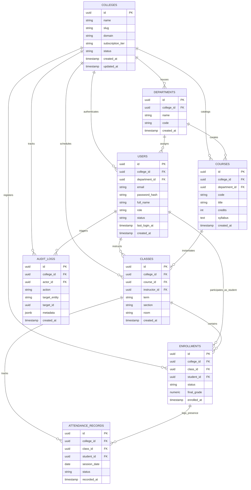

# UniFlow Architecture Specification: Multi-Tenant Relational Database Architecture

**Project Name:** UniFlow Multi-Tenant Academic OS  
**Target Engine:** PostgreSQL 16 (Relational OLTP)  
**Isolation Paradigm:** Shared Process, Shared Database, Shared Schema with Discriminator Column (`college_id`) and Row-Level Security (RLS)  
**Standard Compliance:** 3rd Normal Form (3NF), ISO/IEC 11179 Metadata Registry

---

## 1. Architectural Strategy & Multi-Tenancy Overview

UniFlow serves multiple higher-education institutions from a unified backend infrastructure. To balance infrastructure cost, operational maintainability, and enterprise-grade tenant privacy, UniFlow implements a **Discriminator Column Multi-Tenancy Pattern** augmented with PostgreSQL **Row-Level Security (RLS)**:

1. **Logical Tenant Boundary:** Every domain entity (departments, users, courses, classes, enrollments, attendance, audit logs) carries an immutable `college_id` foreign key referencing the root `colleges` table.
2. **Deterministic Data Isolation:** Application queries pass the active tenant context via session configuration (`SET LOCAL app.current_tenant_id = '...'`). PostgreSQL RLS policies enforce tenant boundaries at the database engine level, eliminating data leakage even in the event of an application-layer bug.
3. **Compound Primary & Unique Keys:** Natural constraints (e.g., student registration numbers, course codes) are scoped strictly per tenant by indexing `(college_id, code)` or `(college_id, email)`.

---

## 2. Complete Entity-Relationship (ER) Diagram (Mermaid.js)



---

## 3. Relational Schema Data Dictionary

### 3.1. `colleges` (Tenant Master Entity)

The root registry representing each subscribed college or university campus.

| Column Name         | Type           | Modifiers / Constraints                                                                        | Description                                                           |
| :------------------ | :------------- | :--------------------------------------------------------------------------------------------- | :-------------------------------------------------------------------- |
| `id`                | `UUID`         | `PRIMARY KEY DEFAULT gen_random_uuid()`                                                        | Immutable global tenant identifier.                                   |
| `name`              | `VARCHAR(255)` | `NOT NULL`                                                                                     | Formal institutional legal name.                                      |
| `slug`              | `VARCHAR(63)`  | `NOT NULL UNIQUE`                                                                              | URL-friendly identifier for tenant subdomains (`tenant.uniflow.app`). |
| `domain`            | `VARCHAR(255)` | `UNIQUE`                                                                                       | Custom CNAME or institution email domain (e.g., `mit.edu`).           |
| `subscription_tier` | `VARCHAR(32)`  | `NOT NULL DEFAULT 'standard' CHECK (subscription_tier IN ('trial', 'standard', 'enterprise'))` | Commercial tier for feature gating.                                   |
| `status`            | `VARCHAR(20)`  | `NOT NULL DEFAULT 'active' CHECK (status IN ('active', 'suspended', 'archived'))`              | Operational state of the tenant.                                      |
| `created_at`        | `TIMESTAMPTZ`  | `NOT NULL DEFAULT clock_timestamp()`                                                           | Creation timestamp in UTC.                                            |
| `updated_at`        | `TIMESTAMPTZ`  | `NOT NULL DEFAULT clock_timestamp()`                                                           | Timestamp of last metadata mutation.                                  |

---

### 3.2. `departments`

Academic departments operating under a specific institution (e.g., Department of Computer Science).

| Column Name  | Type           | Modifiers / Constraints                              | Description                      |
| :----------- | :------------- | :--------------------------------------------------- | :------------------------------- |
| `id`         | `UUID`         | `PRIMARY KEY DEFAULT gen_random_uuid()`              | Unique department identifier.    |
| `college_id` | `UUID`         | `NOT NULL REFERENCES colleges(id) ON DELETE CASCADE` | Tenant discriminator key.        |
| `name`       | `VARCHAR(150)` | `NOT NULL`                                           | Full department name.            |
| `code`       | `VARCHAR(20)`  | `NOT NULL`                                           | Short code (e.g., `CSE`, `ECE`). |
| `created_at` | `TIMESTAMPTZ`  | `NOT NULL DEFAULT clock_timestamp()`                 | Creation audit timestamp.        |

_Unique Index:_ `UNIQUE (college_id, code)` — Ensures department codes are unique only within the respective college.

---

### 3.3. `users`

All identities authenticated across the system, including super-admins, college administrators, faculty, and students.

| Column Name     | Type           | Modifiers / Constraints                                                           | Description                                  |
| :-------------- | :------------- | :-------------------------------------------------------------------------------- | :------------------------------------------- |
| `id`            | `UUID`         | `PRIMARY KEY DEFAULT gen_random_uuid()`                                           | Unique user identifier.                      |
| `college_id`    | `UUID`         | `NOT NULL REFERENCES colleges(id) ON DELETE CASCADE`                              | Tenant discriminator key.                    |
| `department_id` | `UUID`         | `NULLABLE REFERENCES departments(id) ON DELETE SET NULL`                          | Associated academic division.                |
| `email`         | `VARCHAR(255)` | `NOT NULL`                                                                        | Institutional login email address.           |
| `password_hash` | `TEXT`         | `NOT NULL`                                                                        | Argon2id / bcrypt encrypted credential hash. |
| `full_name`     | `VARCHAR(150)` | `NOT NULL`                                                                        | Legal full name of the user.                 |
| `role`          | `VARCHAR(20)`  | `NOT NULL CHECK (role IN ('ADMIN', 'FACULTY', 'STUDENT'))`                        | Role-Based Access Control (RBAC) token.      |
| `status`        | `VARCHAR(20)`  | `NOT NULL DEFAULT 'active' CHECK (status IN ('active', 'inactive', 'suspended'))` | Account lifecycle state.                     |
| `last_login_at` | `TIMESTAMPTZ`  | `NULLABLE`                                                                        | Last successful session initiation.          |
| `created_at`    | `TIMESTAMPTZ`  | `NOT NULL DEFAULT clock_timestamp()`                                              | Account provisioning timestamp.              |

_Unique Index:_ `UNIQUE (college_id, email)` — Allows identical user emails across distinct colleges without collision.

---

### 3.4. `courses`

The academic curriculum catalog maintained by departments.

| Column Name     | Type           | Modifiers / Constraints                                  | Description                                 |
| :-------------- | :------------- | :------------------------------------------------------- | :------------------------------------------ |
| `id`            | `UUID`         | `PRIMARY KEY DEFAULT gen_random_uuid()`                  | Unique course record ID.                    |
| `college_id`    | `UUID`         | `NOT NULL REFERENCES colleges(id) ON DELETE CASCADE`     | Tenant discriminator key.                   |
| `department_id` | `UUID`         | `NOT NULL REFERENCES departments(id) ON DELETE RESTRICT` | Academic owner of course syllabus.          |
| `code`          | `VARCHAR(30)`  | `NOT NULL`                                               | Official course identifier (e.g., `CS101`). |
| `title`         | `VARCHAR(200)` | `NOT NULL`                                               | Formal course descriptive title.            |
| `credits`       | `SMALLINT`     | `NOT NULL DEFAULT 3 CHECK (credits > 0)`                 | Earnable credit weighting.                  |
| `syllabus`      | `TEXT`         | `NULLABLE`                                               | Detailed description and course outcomes.   |
| `created_at`    | `TIMESTAMPTZ`  | `NOT NULL DEFAULT clock_timestamp()`                     | Catalog creation date.                      |

_Unique Index:_ `UNIQUE (college_id, code)` — Guarantees unique course codes within a college.

---

### 3.5. `classes` (Sections / Cohorts)

A live offering of a course in a given term or semester with an assigned faculty instructor.

| Column Name     | Type          | Modifiers / Constraints                              | Description                            |
| :-------------- | :------------ | :--------------------------------------------------- | :------------------------------------- |
| `id`            | `UUID`        | `PRIMARY KEY DEFAULT gen_random_uuid()`              | Unique section ID.                     |
| `college_id`    | `UUID`        | `NOT NULL REFERENCES colleges(id) ON DELETE CASCADE` | Tenant discriminator key.              |
| `course_id`     | `UUID`        | `NOT NULL REFERENCES courses(id) ON DELETE CASCADE`  | Parent course syllabus link.           |
| `instructor_id` | `UUID`        | `NOT NULL REFERENCES users(id) ON DELETE RESTRICT`   | Assigned faculty member.               |
| `term`          | `VARCHAR(32)` | `NOT NULL`                                           | Academic period (e.g., `Fall 2026`).   |
| `section`       | `VARCHAR(16)` | `NOT NULL DEFAULT 'A'`                               | Cohort/section division indicator.     |
| `room`          | `VARCHAR(64)` | `NULLABLE`                                           | Assigned physical lecture hall or lab. |
| `created_at`    | `TIMESTAMPTZ` | `NOT NULL DEFAULT clock_timestamp()`                 | Class scheduled date.                  |

_Unique Index:_ `UNIQUE (college_id, course_id, term, section)`

---

### 3.6. `enrollments`

Binds a student to an active course section.

| Column Name   | Type           | Modifiers / Constraints                                                              | Description                    |
| :------------ | :------------- | :----------------------------------------------------------------------------------- | :----------------------------- |
| `id`          | `UUID`         | `PRIMARY KEY DEFAULT gen_random_uuid()`                                              | Unique enrollment ID.          |
| `college_id`  | `UUID`         | `NOT NULL REFERENCES colleges(id) ON DELETE CASCADE`                                 | Tenant discriminator key.      |
| `class_id`    | `UUID`         | `NOT NULL REFERENCES classes(id) ON DELETE CASCADE`                                  | Enrolled class section.        |
| `student_id`  | `UUID`         | `NOT NULL REFERENCES users(id) ON DELETE CASCADE`                                    | Enrolled student identity.     |
| `status`      | `VARCHAR(20)`  | `NOT NULL DEFAULT 'enrolled' CHECK (status IN ('enrolled', 'dropped', 'completed'))` | Enrollment status.             |
| `final_grade` | `NUMERIC(5,2)` | `NULLABLE CHECK (final_grade >= 0.00 AND final_grade <= 100.00)`                     | Final awarded numerical score. |
| `enrolled_at` | `TIMESTAMPTZ`  | `NOT NULL DEFAULT clock_timestamp()`                                                 | Registration timestamp.        |

_Unique Index:_ `UNIQUE (college_id, class_id, student_id)` — Prevents duplicate student registrations in the same class.

---

### 3.7. `attendance_records`

Daily or session-based tracking of physical/virtual presence.

| Column Name    | Type          | Modifiers / Constraints                                               | Description                  |
| :------------- | :------------ | :-------------------------------------------------------------------- | :--------------------------- |
| `id`           | `UUID`        | `PRIMARY KEY DEFAULT gen_random_uuid()`                               | Unique attendance record ID. |
| `college_id`   | `UUID`        | `NOT NULL REFERENCES colleges(id) ON DELETE CASCADE`                  | Tenant discriminator key.    |
| `class_id`     | `UUID`        | `NOT NULL REFERENCES classes(id) ON DELETE CASCADE`                   | Target class section.        |
| `student_id`   | `UUID`        | `NOT NULL REFERENCES users(id) ON DELETE CASCADE`                     | Target student record.       |
| `session_date` | `DATE`        | `NOT NULL DEFAULT CURRENT_DATE`                                       | Calendar day of class.       |
| `status`       | `VARCHAR(20)` | `NOT NULL CHECK (status IN ('present', 'absent', 'late', 'excused'))` | Presence outcome.            |
| `recorded_at`  | `TIMESTAMPTZ` | `NOT NULL DEFAULT clock_timestamp()`                                  | Audit entry timestamp.       |

_Unique Index:_ `UNIQUE (college_id, class_id, student_id, session_date)`

---

### 3.8. `audit_logs`

Immutable compliance and security ledger capturing write events across tenants.

| Column Name     | Type          | Modifiers / Constraints                              | Description                                                 |
| :-------------- | :------------ | :--------------------------------------------------- | :---------------------------------------------------------- |
| `id`            | `UUID`        | `PRIMARY KEY DEFAULT gen_random_uuid()`              | Unique audit log ID.                                        |
| `college_id`    | `UUID`        | `NOT NULL REFERENCES colleges(id) ON DELETE CASCADE` | Tenant discriminator key.                                   |
| `actor_id`      | `UUID`        | `NULLABLE REFERENCES users(id) ON DELETE SET NULL`   | Performing user identity.                                   |
| `action`        | `VARCHAR(64)` | `NOT NULL`                                           | Action code (e.g., `USER_LOGIN`, `GRADE_UPDATE`).           |
| `target_entity` | `VARCHAR(64)` | `NOT NULL`                                           | Table impacted (e.g., `enrollments`).                       |
| `target_id`     | `UUID`        | `NULLABLE`                                           | ID of the affected entity.                                  |
| `metadata`      | `JSONB`       | `NOT NULL DEFAULT '{}'`                              | Payload delta (old vs. new values, IP address, user agent). |
| `created_at`    | `TIMESTAMPTZ` | `NOT NULL DEFAULT clock_timestamp()`                 | Event occurrence timestamp.                                 |

---

## 4. Multi-Tenant Row-Level Security (RLS) Implementation

To ensure non-negotiable data isolation at the database engine tier, every query executed by the FastAPI backend sets the active tenant context using PostgreSQL session variables:

```sql
-- Executed by FastAPI connection pool upon checking out a connection:
SET LOCAL app.current_tenant_id = 'c1234567-89ab-cdef-0123-456789abcdef';
```

### PostgreSQL Policy Definitions

```sql
-- 1. Enable RLS on all tenant-isolated tables
ALTER TABLE departments ENABLE ROW LEVEL SECURITY;
ALTER TABLE users ENABLE ROW LEVEL SECURITY;
ALTER TABLE courses ENABLE ROW LEVEL SECURITY;
ALTER TABLE classes ENABLE ROW LEVEL SECURITY;
ALTER TABLE enrollments ENABLE ROW LEVEL SECURITY;
ALTER TABLE attendance_records ENABLE ROW LEVEL SECURITY;
ALTER TABLE audit_logs ENABLE ROW LEVEL SECURITY;

-- 2. Define Tenant Isolation Policies (Example on Users and Courses)
CREATE POLICY tenant_isolation_users ON users
    FOR ALL
    USING (college_id = NULLIF(current_setting('app.current_tenant_id', true), '')::UUID)
    WITH CHECK (college_id = NULLIF(current_setting('app.current_tenant_id', true), '')::UUID);

CREATE POLICY tenant_isolation_courses ON courses
    FOR ALL
    USING (college_id = NULLIF(current_setting('app.current_tenant_id', true), '')::UUID)
    WITH CHECK (college_id = NULLIF(current_setting('app.current_tenant_id', true), '')::UUID);

CREATE POLICY tenant_isolation_classes ON classes
    FOR ALL
    USING (college_id = NULLIF(current_setting('app.current_tenant_id', true), '')::UUID)
    WITH CHECK (college_id = NULLIF(current_setting('app.current_tenant_id', true), '')::UUID);

CREATE POLICY tenant_isolation_enrollments ON enrollments
    FOR ALL
    USING (college_id = NULLIF(current_setting('app.current_tenant_id', true), '')::UUID)
    WITH CHECK (college_id = NULLIF(current_setting('app.current_tenant_id', true), '')::UUID);
```

---

## 5. Performance Optimization & Indexing Strategy

1. **B-Tree Foreign Key Indexes:** All foreign keys pointing to `college_id` include dedicated B-Tree indices to support fast nested-loop joins and instant tenant deletions via cascade triggers.
2. **Compound Filter Indexes:** Common read paths (e.g., fetching a student's active classes) leverage compound indexing:
   - `idx_users_tenant_role` ON `users (college_id, role)`
   - `idx_classes_tenant_term` ON `classes (college_id, term)`
   - `idx_enrollments_student` ON `enrollments (college_id, student_id)`
3. **Partitioning Readiness:** For high-volume tables (`attendance_records`, `audit_logs`), the architecture supports declarative declarative range partitioning by `session_date` or hash partitioning by `college_id` when horizontal scale demands it.
4.
